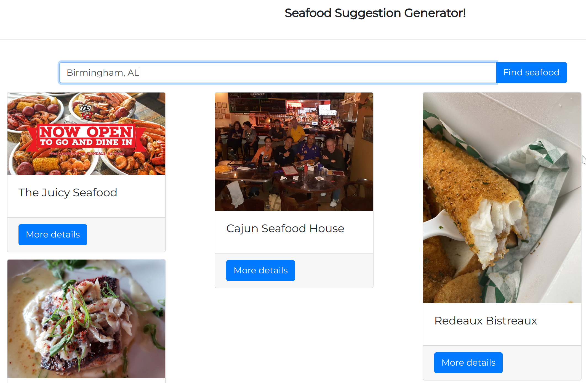

# Seafood Restaurant Finder
This is a web application that allows the user to enter their city and receive seafood restaurant suggestions. Everyone loves seafood!

## Dependencies and Tools Used

- Python3
- Pip - python package manager
- [Flask](https://flask.palletsprojects.com/en/1.1.x/) - Python web framework used to build web applications
- Database for local testing: [MariaDB](https://mariadb.org/download/)
- Database on production environment: Amazon Relational Database Service
- Yelp API is used to find restaurants

## Deployed

Deployed using Amazon's AWS Elastic Beanstalk service.
The website is live at:  
http://seafood-restaurant-finder-dev2.us-west-2.elasticbeanstalk.com/  

